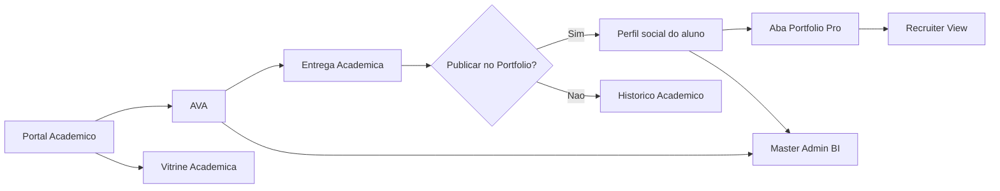
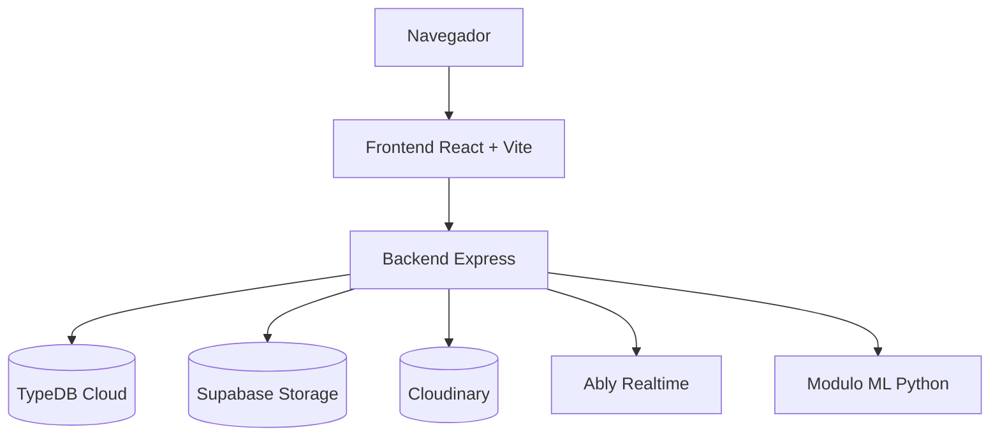
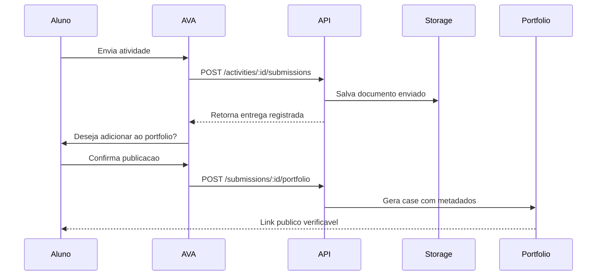
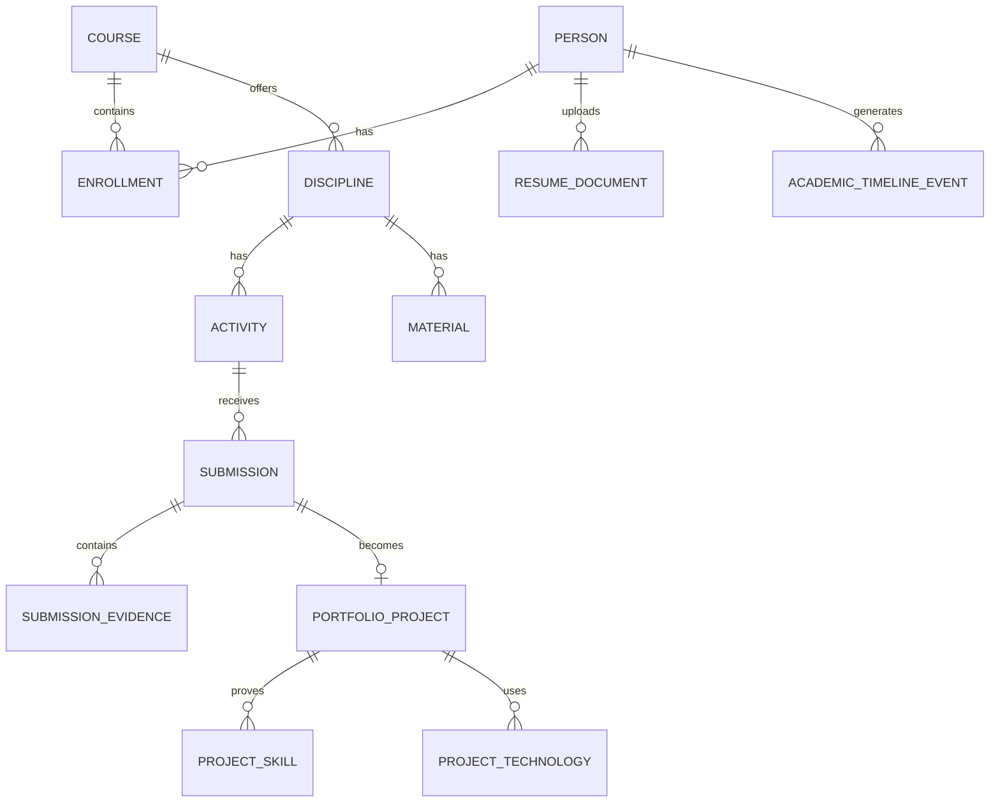

# UNIGRAN Comunidades

> Plataforma academica integrada para portal institucional, AVA, rede social universitaria, portfolio inteligente, reputacao profissional verificavel e analytics interno.


## Sumario

1. [Resumo do Projeto](#resumo-do-projeto)
2. [Problema de Pesquisa](#problema-de-pesquisa)
3. [Objetivos](#objetivos)
4. [Proposta de Solucao](#proposta-de-solucao)
5. [Modulos do Sistema](#modulos-do-sistema)
6. [Arquitetura](#arquitetura)
7. [Fluxo Principal](#fluxo-principal)
8. [Tecnologias](#tecnologias)
9. [Estrutura do Repositorio](#estrutura-do-repositorio)
10. [Configuracao do Ambiente](#configuracao-do-ambiente)
11. [Como Executar](#como-executar)
12. [Principais Rotas da API](#principais-rotas-da-api)
13. [Modelagem de Dados](#modelagem-de-dados)
14. [Machine Learning e Analytics](#machine-learning-e-analytics)
15. [Seguranca e Permissoes](#seguranca-e-permissoes)
16. [Evidencias para TCC](#evidencias-para-tcc)
17. [Limitacoes Conhecidas](#limitacoes-conhecidas)
18. [Roadmap](#roadmap)
19. [Autores e Contexto Academico](#autores-e-contexto-academico)

---

## Resumo do Projeto

O **UNIGRAN Comunidades** e uma plataforma academica moderna que integra tres experiencias fundamentais:

- **Portal Academico:** area institucional, informativa e publica.
- **AVA:** ambiente operacional para disciplinas, materiais, atividades, entregas, notas, forum e acompanhamento.
- **Portfolio Inteligente:** vitrine profissional publica do aluno, alimentada automaticamente por entregas academicas.

A proposta central e transformar atividades academicas em **evidencias profissionais verificaveis**. Em vez de o aluno criar manualmente um portfolio externo, o sistema aproveita aquilo que ele ja produz no AVA, organiza como case profissional e disponibiliza para recrutadores em um formato moderno, objetivo e confiavel.

O produto busca aproximar universidade, aluno e mercado de trabalho por meio de uma experiencia inspirada em plataformas como LinkedIn, GitHub, Behance, dashboards SaaS e ambientes educacionais premium.

---

## Problema de Pesquisa

Em muitos ambientes universitarios, existe uma separacao clara entre:

- o que o aluno aprende;
- o que o aluno entrega nas disciplinas;
- o que a instituicao consegue acompanhar;
- o que empresas conseguem avaliar sobre esse aluno.

Essa separacao cria varios problemas:

- trabalhos academicos ficam restritos ao AVA;
- entregas relevantes nao viram reputacao profissional;
- recrutadores nao conseguem avaliar competencias reais rapidamente;
- portfolios precisam ser cadastrados manualmente em ferramentas externas;
- coordenadores e professores tem pouca visibilidade sobre evolucao profissional;
- dashboards institucionais costumam ser desconectados da jornada do aluno.

### Pergunta Norteadora

Como uma plataforma academica pode transformar atividades, entregas e evidencias do AVA em um portfolio profissional verificavel, facilitando a avaliacao de competencias por recrutadores e melhorando a gestao academica da instituicao?

---

## Objetivos

### Objetivo Geral

Desenvolver uma plataforma academica integrada capaz de conectar portal institucional, AVA, portfolio inteligente e analytics interno, transformando atividades academicas em reputacao profissional verificavel.

### Objetivos Especificos

- Criar uma experiencia academica moderna e responsiva.
- Reorganizar o portal institucional com foco em cursos, eventos, noticias, projetos e talentos.
- Separar melhor os fluxos de aluno, professor, coordenacao e administracao.
- Melhorar o AVA com dashboards, progresso, atividades, entregas, notificacoes e suporte contextual.
- Criar um fluxo de publicacao que transforme entregas academicas em cases profissionais.
- Gerar portfolio publico com projetos, competencias, tecnologias, evidencias e curriculo vivo.
- Disponibilizar visual recruiter-friendly para leitura rapida de perfil.
- Criar um endpoint de BI interno para administracao/master admin.
- Documentar a modelagem de banco necessaria para evolucao enterprise.

---

## Proposta de Solucao

A solucao proposta e um ecossistema academico em que cada modulo possui papel claro, mas todos se conectam.



### Ideia Central

O aluno nao deve precisar cadastrar tudo manualmente. O sistema deve aproveitar dados reais ja existentes no AVA:

- disciplina;
- atividade;
- professor;
- semestre;
- nota;
- feedback;
- arquivo enviado;
- link externo;
- tecnologias inferidas;
- competencias desenvolvidas;
- timeline de desenvolvimento.

Esses dados passam a alimentar automaticamente o portfolio, o curriculo vivo, a vitrine institucional e os indicadores internos.

---

## Modulos do Sistema

## 1. Portal Academico

O Portal Academico e a area institucional e publica da plataforma.

### Funcionalidades

- Home institucional moderna.
- Cards de acesso aos principais modulos.
- Vitrine academica com projetos em destaque.
- Area de talentos.
- Destaques de cursos, eventos e calendario academico.
- Integracao com login.
- Acesso ao AVA.
- Acesso ao portfolio publico.

### Objetivo no TCC

Demonstrar como a instituicao pode expor sua producao academica e valorizar alunos, projetos e competencias de forma publica e organizada.

---

## 2. AVA

O AVA e o ambiente operacional academico do aluno e do professor.

### Painel do Aluno

- Disciplinas matriculadas.
- Progresso academico.
- Atividades pendentes.
- Proxima entrega.
- Notificacoes.
- Forum.
- Materiais.
- Entregas.
- Metas e XP academico.
- Portfolio conectado.

### Experiencia por Disciplina

Cada disciplina possui:

- visao geral;
- materiais;
- atividades;
- forum;
- status visual;
- progresso;
- notas;
- IA contextual;
- acompanhamento de entregas.

### Fluxo de Entrega

1. O aluno escreve a resposta.
2. Anexa documento, link externo, GitHub, Figma, Drive ou deploy.
3. Envia a atividade.
4. O sistema pergunta se a entrega deve virar case profissional.
5. Se confirmado, o sistema cria o item no portfolio.

---

## 3. Portfolio Inteligente

O Portfolio Inteligente e o **Academic Case Hub** do aluno.

Ele nao funciona como uma galeria simples. Ele e uma central profissional que organiza:

- projetos;
- competencias;
- tecnologias;
- certificados;
- entregas;
- curriculo vivo;
- timeline;
- evidencias;
- score profissional;
- visual recruiter-friendly.

### Dados de um Projeto

Cada projeto pode conter:

- titulo;
- thumbnail;
- banner;
- resumo profissional;
- problema resolvido;
- disciplina relacionada;
- professor/orientador;
- semestre;
- tecnologias utilizadas;
- competencias desenvolvidas;
- nota;
- status;
- dificuldade;
- evidencias;
- links externos;
- timeline.

### Evidencias

O projeto suporta evidencias como:

- PDF;
- DOCX;
- imagens;
- videos;
- GitHub;
- deploy;
- Figma;
- documentacao;
- Drive;
- anexos do AVA.

---

## 4. Perfil Publico

O sistema oferece rota publica para portfolio:

```http
GET /portfolio/:username
GET /portfolio/:username/:activityId
GET /u/:username
```

O perfil publico apresenta:

- identidade profissional;
- projetos;
- stack tecnologica;
- competencias;
- timeline;
- curriculo;
- links profissionais;
- recruiter view.

---

## 5. Master Admin BI

O BI interno e um modulo administrativo separado do Portal Academico e do Portfolio Pro. Ele consome dados consolidados por API e fica restrito a perfis master/admin.

```http
GET /api/admin/power-bi
```

Esse endpoint agrega dados de:

- usuarios;
- posts;
- comentarios;
- entregas;
- portfolios;
- progresso academico;
- cursos;
- indicadores de engajamento.

No frontend, o acesso aparece como item proprio de navegacao: **Master BI**.

O objetivo e permitir uma visao gerencial sem duplicar toda a base transacional.

---

## Arquitetura

### Visao Geral



### Frontend

- React 18.
- Vite.
- Framer Motion.
- Lucide Icons.
- Context API para autenticacao e toasts.
- CSS global com identidade visual propria.
- Layout responsivo.
- Componentes reutilizaveis.

### Backend

- Node.js.
- Express.
- Socket.io.
- JWT.
- Zod para validacao.
- TypeDB Cloud via HTTP driver.
- Supabase Storage para documentos.
- Cloudinary para midias visuais.
- Ably para recursos realtime.

### Armazenamento

| Camada | Responsabilidade |
|---|---|
| TypeDB | Usuarios, posts, relacoes, metadados, autenticacao, portfolio e dados estruturados |
| Supabase Storage | Documentos do AVA, PDFs, DOCX e entregas academicas |
| Cloudinary | Imagens, videos, posts e midias sociais |
| Arquivos locais temporarios | Estado de demonstracao do AVA em desenvolvimento |

---

## Fluxo Principal

### Da Atividade ao Portfolio



### Metadados Gerados

Ao publicar a entrega no portfolio, o backend gera:

- resumo;
- tecnologias;
- competencias;
- tags;
- dificuldade;
- status;
- nota;
- professor;
- semestre;
- evidencias;
- timeline;
- link publico.

---

## Tecnologias

### Frontend

| Tecnologia | Uso |
|---|---|
| React | Interface SPA |
| Vite | Build e dev server |
| Framer Motion | Animacoes e microinteracoes |
| Lucide React | Iconografia |
| CSS custom | Design system visual do projeto |

### Backend

| Tecnologia | Uso |
|---|---|
| Node.js | Runtime |
| Express | API REST |
| Socket.io | Realtime |
| JWT | Autenticacao |
| Zod | Validacao |
| TypeDB HTTP Driver | Banco principal |
| Multer | Upload |
| Supabase Storage | Documentos |
| Cloudinary | Midias |

### Dados e IA

| Tecnologia | Uso |
|---|---|
| TypeDB | Dados conectados e relacionais/semanticos |
| Python | Modulo de ML |
| scikit-learn | Modelos de clusterizacao e recomendacao |
| CSV/JSON | Outputs analiticos |

---

## Estrutura do Repositorio

```text
Unigran/
  README.md
  docs/
    architecture-report.md
    ml-artifacts.md
    modelagem-bd-ecossistema-academico.pdf
    modelagem-bd-ecossistema-academico.html

  frontend/
    index.html
    package.json
    vite.config.js
    src/
      App.jsx
      main.jsx
      styles/
        global.css
        components.css
      contexts/
        AuthContext.jsx
        ToastContext.jsx
      components/
        layout/
        post/
        community/
        media/
        ui/
      modules/
        platform/
          AcademicPortalPage.jsx
          CampusPage.jsx
          MasterAdminBiPage.jsx
          PortfolioIntelligencePage.jsx
          platform.js
        shared/
          permissions.js
      pages/
        LoginPage.jsx
        RegisterPage.jsx
        HomePage.jsx
        ProfilePage.jsx
        PublicProfilePage.jsx

  backend/
    package.json
    src/
      index.js
      db/
        typedb.js
      middleware/
        auth.js
        audit.js
      routes/
        auth.js
        admin.js
        users.js
        posts.js
        portfolio.js
        uploads.js
      modules/
        index.js
        platformData.js
        auth/
          rbac.js
        academic/
          avaRoutes.js
          typedbAvaStore.js
          typedbPortfolioStore.js
          avaStore.js (legado)
      services/
        portfolio-ml.service.js
        resume.service.js
        cloudinary.service.js
        audit.service.js
      socket/
        handlers.js
    typeql/
      portfolio-schema.typeql
      e2ee-schema.typeql
    supabase/
      001_portfolio_academico.sql
    project_ml/
```

---

## Configuracao do Ambiente

### Pre-requisitos

- Node.js 18 ou superior.
- npm.
- Conta/configuracao no TypeDB Cloud.
- Opcional: Supabase para documentos.
- Opcional: Cloudinary para midias.
- Opcional: Ably para realtime.
- Opcional: Python 3.10+ para modulo ML.

### Variaveis do Backend

Crie `backend/.env` com base nos exemplos do projeto.

```env
TYPEDB_ADDRESS=https://seu-cluster.typedb.com:80
TYPEDB_DATABASE=unigran_db
TYPEDB_USERNAME=admin
TYPEDB_PASSWORD=sua_senha

JWT_SECRET=troque_este_segredo
JWT_EXPIRES_IN=7d

PORT=3001
NODE_ENV=development
CLIENT_URL=http://localhost:5173
PUBLIC_APP_URL=http://localhost:5173
PUBLIC_PORTFOLIO_BASE_URL=http://localhost:5173

CLOUDINARY_CLOUD_NAME=demo
CLOUDINARY_API_KEY=123456789012345
CLOUDINARY_API_SECRET=your_cloudinary_api_secret

SUPABASE_URL=https://seu-projeto.supabase.co
SUPABASE_SERVICE_ROLE_KEY=sua_service_role_key
SUPABASE_DOCUMENTS_BUCKET=ava-entregas

ABLY_API_KEY=your_ably_root_api_key
JIGSAWSTACK_API_KEY=your_jigsawstack_api_key
JIGSAWSTACK_NSFW_THRESHOLD=0.72

ML_OUTPUTS_DRIVE_URL=https://drive.google.com/...
ML_MODELS_DRIVE_URL=https://drive.google.com/...
```

> Importante: o arquivo `.env` contem credenciais sensiveis e nao deve ser versionado.

### Observacao sobre TypeDB em Desenvolvimento

O sistema nao possui acesso sem login nem fallback de usuario local. Mesmo em desenvolvimento, as rotas protegidas exigem JWT valido emitido pelo login real. Se o TypeDB Cloud estiver indisponivel ou com credenciais invalidas, a autenticacao deve falhar ate que o banco seja corrigido.

---

## Como Executar

### Backend

```bash
cd backend
npm install
npm run dev
```

Backend padrao:

```text
http://localhost:3001
```

Health check:

```http
GET http://localhost:3001/api/health
```

### Frontend

```bash
cd frontend
npm install
npm run dev
```

Frontend padrao:

```text
http://localhost:5173
```

### Build de Producao

```bash
cd frontend
npm run build
```

### Preview do Build

```bash
cd frontend
npm run preview
```

---

## Principais Rotas da API

### Autenticacao

| Metodo | Rota | Descricao |
|---|---|---|
| POST | `/api/auth/register` | Cadastro de usuario |
| POST | `/api/auth/login` | Login com JWT |
| GET | `/api/auth/me` | Sessao atual |
| POST | `/api/auth/google` | Login com Google |
| POST | `/api/auth/reset-password/request` | Solicita codigo de reset |
| POST | `/api/auth/reset-password/verify` | Valida codigo |
| PUT | `/api/auth/reset-password` | Redefine senha |

### Plataforma Academica

| Metodo | Rota | Descricao |
|---|---|---|
| GET | `/api/platform/v1/modules` | Lista modulos por permissao |
| GET | `/api/platform/v1/dashboard` | Dashboard por role |
| POST | `/api/platform/v1/ai/assistant` | Assistente RAi |
| GET | `/api/platform/v1/ava` | Estado do AVA |

#### RAi Assistente

O RAi recebe a mensagem atual e o historico recente da conversa:

```json
{
  "prompt": "Tenho prova hoje de algoritmos",
  "messages": [{ "role": "user", "content": "Curso Sistemas de Informacao" }],
  "selectedCourseId": "curso-opcional",
  "useWebSearch": true
}
```

O backend consulta apenas o contexto academico autorizado para o usuario autenticado, detecta perfil, intencao, tom, area e dificuldade, e gera a resposta usando o prompt base do RAi. Para habilitar a conversa generativa com Groq, configure `RAI_AI_API_KEY`, `RAI_AI_API_URL=https://api.groq.com/openai/v1/chat/completions` e `RAI_AI_MODEL=llama-3.3-70b-versatile`. Sem provedor, o RAi informa somente fatos recuperados do portal, sem inventar orientacoes.

O contexto interno e filtrado por escopo: estudante usa somente sua jornada; professor usa disciplinas e turmas atribuidas; coordenacao usa cursos sob responsabilidade; secretaria e admin usam apenas instituicoes vinculadas; super admin pode consultar a estrutura global. O historico permite continuidade da conversa, mas nao treina permanentemente o modelo com dados dos usuarios.

No RBAC administrativo, `super_admin` e o admin global: cria instituicoes, nomeia administradores e acessa auditoria/dashboards globais. `admin` e institucional e opera apenas nas instituicoes com vinculo aprovado. `social_admin` administra logins e moderacao da rede social, sem receber acesso a estrutura academica institucional.

Para complementar perguntas gerais com fontes publicas do Tavily Search, configure:

```env
RAI_WEB_SEARCH_ENABLED=true
TAVILY_API_KEY=tvly-sua_chave
```

A pesquisa publica usa o modo `basic` do Tavily para economizar creditos e complementa explicacoes e referencias; ela nao amplia acesso a aulas, salas, turmas, notas ou qualquer dado institucional interno.

### AVA

| Metodo | Rota | Descricao |
|---|---|---|
| POST | `/api/platform/v1/ava/materials/:materialId/complete` | Marca material como concluido |
| POST | `/api/platform/v1/ava/activities/:activityId/submissions` | Envia atividade |
| POST | `/api/platform/v1/ava/submissions/:submissionId/portfolio` | Transforma entrega em case profissional |
| POST | `/api/platform/v1/ava/courses/:courseId/forum` | Cria topico no forum |
| POST | `/api/platform/v1/ava/courses/:courseId/forum/:postId/comments` | Comenta no forum |
| POST | `/api/platform/v1/ava/coordination/courses/:courseId/enrollments` | Matricula aluno em disciplina |
| PUT | `/api/platform/v1/ava/coordination/courses/:courseId/teacher` | Designa professor responsavel |

### Professor

| Metodo | Rota | Descricao |
|---|---|---|
| GET | `/api/platform/v1/ava/teacher/submissions` | Lista entregas |
| POST | `/api/platform/v1/ava/teacher/courses/:courseId/materials` | Cria material |
| POST | `/api/platform/v1/ava/teacher/courses/:courseId/activities` | Cria atividade |
| PATCH | `/api/platform/v1/ava/teacher/submissions/:submissionId` | Publica nota e feedback |

### Portfolio

| Metodo | Rota | Descricao |
|---|---|---|
| GET | `/portfolio/:username` | Portfolio publico |
| GET | `/portfolio/:username/:activityId` | Case especifico |
| GET | `/u/:username` | Alias de perfil publico profissional |
| GET | `/api/users/:id/portfolio` | Portfolio via API autenticada |

### Admin e BI

| Metodo | Rota | Descricao |
|---|---|---|
| GET | `/api/admin/users` | Usuarios |
| GET | `/api/admin/reports` | Denuncias |
| GET | `/api/admin/audit-logs` | Auditoria |
| GET | `/api/admin/power-bi` | Snapshot interno para BI |

---

## Modelagem de Dados

A modelagem completa esta documentada em PDF:

```text
docs/modelagem-bd-ecossistema-academico.pdf
```

Esse documento descreve:

- entidades principais;
- campos recomendados;
- relacionamentos;
- indices;
- permissoes;
- privacidade;
- APIs recomendadas;
- roadmap de migrations.

### Dominios de Dados



### Principio de Normalizacao

O sistema deve evitar duplicar dados entre AVA e portfolio. A entrega academica e a fonte original; o portfolio deve referenciar a entrega e enriquecer com metadados profissionais.

---

## Machine Learning e Analytics

O projeto possui uma camada de Machine Learning em:

```text
backend/project_ml
```

### Objetivos da Camada ML

- analisar textos de postagens ou entregas;
- sugerir areas profissionais;
- recomendar skills;
- apoiar matching com vagas;
- gerar outputs para dashboards;
- apoiar leitura automatica de competencias.

### Executar API Python

```bash
cd backend
pip install -r requirements-ml.txt
uvicorn project_ml.api.app:app --reload --port 8000
```

Endpoint principal:

```http
POST http://localhost:8000/predict
```

Exemplo:

```json
{
  "texto": "Desenvolvi um dashboard em Power BI usando SQL, indicadores e analise de dados."
}
```

### BI Interno

O endpoint `/api/admin/power-bi` consolida indicadores como:

- usuarios;
- autores ativos;
- posts;
- comentarios;
- interacoes;
- progresso medio;
- entregas;
- portfolios;
- taxa de conversao entrega -> case;
- cursos mais ativos;
- insights RAi.

---

## Seguranca e Permissoes

### Autenticacao

- JWT.
- Senhas com bcrypt.
- Rotas protegidas por middleware.
- Suporte a 2FA.
- Reset de senha por codigo.

### Roles

| Role | Permissoes principais |
|---|---|
| aluno / student / user | AVA, entregas, portfolio, rede social |
| professor | materiais, atividades, correcao, feedback |
| coordination | leitura academica, turmas, alunos em risco |
| secretary | matriculas, registros e documentos institucionais |
| moderator | denuncias e moderacao de conteudo |
| social_admin | logins e administracao da rede social |
| admin | estrutura e usuarios da instituicao atribuida |
| super_admin | controle global, instituicoes, admins, auditoria e BI |

### Privacidade

O portfolio deve respeitar:

- visibilidade publica ou privada;
- exibicao opcional de nota;
- exibicao opcional de telefone/email;
- controle sobre curriculo;
- controle sobre evidencias sensiveis;
- auditoria de acessos administrativos.

---

## Evidencias para TCC

Este repositorio pode ser usado como base pratica para TCC porque contempla:

### Produto

- plataforma funcional;
- interface moderna;
- fluxo academico real;
- integracao AVA -> portfolio;
- perfil publico profissional;
- dashboard interno.

### Engenharia

- frontend React;
- backend Express;
- autenticacao JWT;
- upload de documentos;
- controle de roles;
- APIs REST;
- integracao com banco externo;
- arquitetura modular.

### Pesquisa Aplicada

- problema claro;
- impacto educacional;
- conexao com empregabilidade;
- proposta de reputacao profissional verificavel;
- uso de dados academicos para apoiar recrutamento.

### Documentacao

- README completo;
- PDF de modelagem de banco;
- relatorios de arquitetura;
- documentacao de ML;
- schemas TypeQL e SQL auxiliares.

---

## Limitacoes Conhecidas

Alguns pontos ainda estao em evolucao:

- As migrations TypeDB estao em `backend/migrations/typedb/`: `001_portfolio_schema_extension.tql`, `002_university_roles_extension.tql` e `003_academic_platform_schema.tql`. Aplique com `cd backend && npm run db:migrate:typedb`, depois crie as ofertas iniciais com `npm run db:seed:academic`.
- O Portal Academico ativo grava em TypeDB; `backend/data/ava-store.json` e `avaStore.js` sao apenas legado, sem uso nas rotas do portal.
- `npm run db:seed:academic` executa o seed completo de rede e AVA: professores, alunos, disciplinas, matriculas, materiais, atividades, frequencia, forum, entregas, portfolios, posts, stories, comentarios, curtidas, comunidades, notificacoes e conversas. Para criar contas ausentes, defina `SEED_DEFAULT_PASSWORD` ou as senhas especificas dos professores no `.env`.
- O parser completo de PDF/DOCX para curriculo vivo ainda deve ser aprofundado.
- Visualizador interno de PDF/DOCX ainda pode evoluir para zoom, paginacao e fullscreen.
- Code splitting ainda pode ser melhorado para reduzir tamanho do bundle.
- Credenciais reais de TypeDB/Supabase/Cloudinary precisam estar corretas no ambiente.
- O fallback de login existe apenas para desenvolvimento e nao deve ser usado em producao.

---

## Roadmap

### Curto Prazo

- Finalizar schema definitivo do banco.
- Criar migrations pequenas por dominio.
- Persistir AVA totalmente no banco.
- Melhorar viewer de documentos.
- Criar tela dedicada de vitrine academica publica.
- Adicionar upload de thumbnail/banner do projeto.

### Medio Prazo

- Implementar parser de curriculo PDF/DOCX.
- Criar score profissional mais robusto.
- Adicionar busca de talentos por skill.
- Criar painel de coordenacao com alunos em risco.
- Adicionar recomendacao de vagas.
- Criar cache de analytics.

### Longo Prazo

- Multi-instituicao completo.
- Recrutadores com conta propria.
- Marketplace de talentos academicos.
- Assinaturas digitais de certificados.
- IA contextual por disciplina.
- Analytics preditivo institucional.

---

## Como Demonstrar o Sistema

### Roteiro de Demonstracao

1. Entrar no sistema.
2. Abrir Portal Academico.
3. Mostrar Home Institucional e Vitrine Academica.
4. Abrir AVA.
5. Selecionar disciplina.
6. Enviar atividade.
7. Confirmar publicacao no portfolio.
8. Abrir a aba Portfolio no perfil social.
9. Mostrar Recruiter View.
10. Abrir rota publica `/u/:username`.
11. Abrir Master BI com usuario admin.
12. Apresentar PDF de modelagem do banco.

### Login em Desenvolvimento

Use uma conta real cadastrada no banco configurado no `backend/.env`. O projeto nao deve ser demonstrado com usuario falso, token fixo ou bypass de autenticacao.

---

## Verificacoes Realizadas

Comandos utilizados durante validacao:

```bash
cd frontend
npm run build
```

```bash
cd backend
node --check src/index.js
node --check src/modules/academic/avaRoutes.js
node --check src/modules/academic/typedbAvaStore.js
node --check src/modules/academic/typedbPortfolioStore.js
```

Health check:

```http
GET http://localhost:3001/api/health
```

---

## Autores e Contexto Academico

Projeto desenvolvido como base de pesquisa e implementacao para um sistema academico moderno, com foco em:

- educacao superior;
- plataformas SaaS;
- experiencia do usuario;
- empregabilidade;
- portfolios academicos;
- inteligencia institucional;
- reputacao profissional verificavel.

### Tema Sugerido para TCC

**Desenvolvimento de uma plataforma academica integrada para transformacao de atividades do AVA em portfolios profissionais verificaveis.**

### Possivel Linha de Pesquisa

- Sistemas de informacao.
- Engenharia de software.
- UX em plataformas educacionais.
- Transformacao digital na educacao.
- Inteligencia aplicada a empregabilidade academica.

---

## Licenca

Este projeto e de uso academico e experimental. Ajuste a licenca conforme as regras da instituicao, dos autores e dos servicos externos utilizados.
