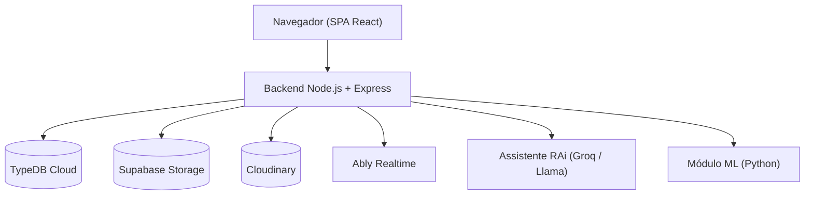
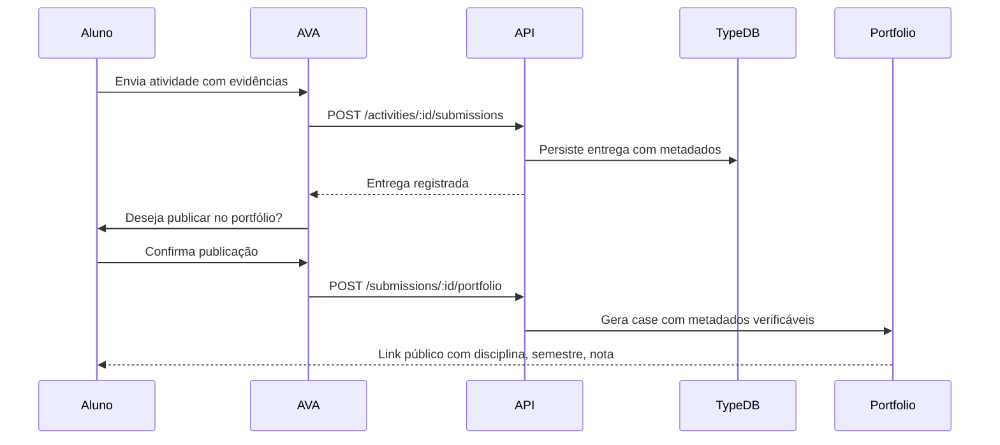
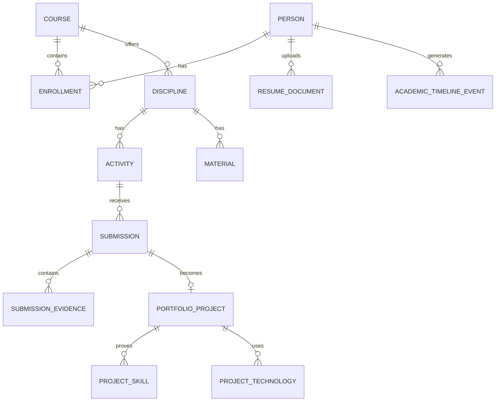

# UNIGRAM — Plataforma Acadêmica Inteligente

> TCC · Tecnologia em Análise e Desenvolvimento de Sistemas · UniCesumar · 2026


---

## Equipe e Contexto Acadêmico

| | |
|---|---|
| **Curso** | Tecnologia em Análise e Desenvolvimento de Sistemas |
| **Instituição** | UniCesumar |
| **Ano** | 2026 |
| **Orientador** | Prof. Me. Alexandre Rodizio Bento |
| **Integrantes** | Fábio Henrique Rodrigues · Felipe Santos da Luz · Gabriel Ozório Franco · Jhonathan Lima · Vinicius Cerqueira Silva |

---

## Sumário

1. [Resumo do Projeto](#resumo-do-projeto)
2. [Problema de Pesquisa](#problema-de-pesquisa)
3. [Objetivos](#objetivos)
4. [Escopo — MVP](#escopo--mvp)
5. [Módulos Implementados](#módulos-implementados)
6. [Arquitetura](#arquitetura)
7. [Fluxo Principal](#fluxo-principal)
8. [Tecnologias](#tecnologias)
9. [Estrutura do Repositório](#estrutura-do-repositório)
10. [Configuração do Ambiente](#configuração-do-ambiente)
11. [Como Executar](#como-executar)
12. [Principais Rotas da API](#principais-rotas-da-api)
13. [Segurança e Permissões](#segurança-e-permissões)
14. [Machine Learning e Assistente RAi](#machine-learning-e-assistente-rai)
15. [Validação Funcional](#validação-funcional)
16. [Limitações Conhecidas](#limitações-conhecidas)
17. [Trabalhos Futuros](#trabalhos-futuros)
18. [Metodologia de Pesquisa](#metodologia-de-pesquisa)
19. [Modelagem de Dados](#modelagem-de-dados)

---

## Resumo do Projeto

A **UNIGRAM** é uma plataforma acadêmica inteligente desenvolvida como TCC do curso de ADS na UniCesumar. Ela integra, em um único ecossistema, cinco ambientes que hoje operam de forma fragmentada nas instituições de ensino superior:

- **Portal Institucional** — área pública com vitrine acadêmica, cursos, eventos e talentos.
- **AVA** — ambiente virtual de aprendizagem com disciplinas, materiais, atividades, entregas, notas e fórum.
- **Portfólio Inteligente** — central profissional do aluno, alimentada automaticamente pelas entregas do AVA.
- **Rede Social Acadêmica** — feed, comunidades, mensagens diretas e stories.
- **Painel Administrativo** — controle institucional hierárquico, auditoria e dashboard de BI.

O diferencial central da plataforma é a **integração nativa entre o AVA e o portfólio profissional**: uma entrega acadêmica avaliada pode virar uma evidência pública verificável com um único clique, carregando metadados de disciplina, semestre, nota e instituição. Isso nenhuma plataforma consolidada (Moodle, Canvas, LinkedIn) oferece de forma nativa.

Este repositório contém o MVP funcional validado. Não é um produto de produção — é a prova de viabilidade técnica da arquitetura proposta.

---

## Problema de Pesquisa

Instituições de ensino superior operam com múltiplos sistemas desconectados: um para gestão acadêmica, outro para o AVA, outro para comunicação, outro para portfólio. Essa fragmentação gera:

- trabalhos e entregas relevantes restritos ao AVA, sem visibilidade externa;
- alunos que precisam recriar manualmente portfólios em ferramentas externas;
- recrutadores sem acesso a evidências verificáveis da produção acadêmica;
- coordenadores com pouca visibilidade sobre a trajetória e o desempenho dos alunos;
- ausência de rastreabilidade entre o que foi ensinado, entregue e aprendido.

### Pergunta Norteadora

> Como uma plataforma acadêmica pode transformar atividades, entregas e evidências do AVA em um portfólio profissional verificável, facilitando a avaliação de competências por recrutadores e melhorando a gestão acadêmica da instituição?

O problema foi fundamentado na literatura (Moran, 2015; Kenski, 2019) e na análise comparativa de plataformas existentes. A lacuna aparece concretamente na análise: nenhuma das plataformas consolidadas marca "Sim" na linha "Conversão em evidências profissionais verificáveis".

---

## Objetivos

### Objetivo Geral

Desenvolver e analisar criticamente uma plataforma acadêmica inteligente que integre gestão institucional hierárquica, AVA, rede social acadêmica, portfólio profissional e assistência contextual por IA — promovendo melhor organização dos fluxos educacionais, maior visibilidade da trajetória discente e apoio à decisão institucional.

### Objetivos Específicos

- Modelar a hierarquia institucional (instituição → campus → curso → semestre → turma → disciplina) com controle de acesso baseado em papéis e escopos.
- Implementar um AVA funcional com materiais, atividades, entregas, notas, fórum e acompanhamento de progresso.
- Criar o fluxo de conversão de entrega acadêmica em case profissional verificável.
- Gerar um portfólio público com projetos, competências, tecnologias e evidências.
- Implementar o assistente RAi com acesso restrito ao contexto autorizado do usuário.
- Desenvolver feed social, comunidades, mensagens e notificações.
- Criar painéis administrativos com auditoria e indicadores de BI.
- Analisar criticamente a solução, incluindo limitações técnicas e trabalhos futuros.

---

## Escopo — MVP

Este trabalho entrega um **MVP (Minimum Viable Product)**. O objetivo é demonstrar viabilidade técnica, não lançar um produto comercial. A distinção é deliberada:

| Aspecto | Status no MVP |
|---|---|
| Fluxos críticos (AVA, portfólio, RBAC, RAi) | ✅ Implementados e validados |
| Migrações TypeDB completas e versionadas | ⚠️ Parcial |
| E2EE em modo estrito | ⚠️ Parcial |
| Painéis administrativos conectados à navegação | ⚠️ Parcial |
| Testes automatizados | ❌ Ausente (trabalho futuro prioritário) |
| React Router (deep links) | ❌ Ausente (navegação por estado) |

O que está provado é a **viabilidade técnica da arquitetura proposta**.

---

## Módulos Implementados

### 1. Portal Institucional

Área pública da plataforma.

- Home institucional com cards de acesso aos módulos.
- Vitrine acadêmica com projetos em destaque.
- Área de talentos e perfis públicos.
- Destaques de cursos e eventos.
- Acesso ao AVA e ao portfólio público.

### 2. AVA — Ambiente Virtual de Aprendizagem

Ambiente operacional para alunos e professores.

**Painel do aluno:**
- Disciplinas matriculadas com progresso visual.
- Atividades pendentes e próximas entregas.
- Materiais (vídeo, PDF, links externos).
- Entregas com suporte a PDF, DOCX, imagens, vídeos, GitHub, Figma, deploy e Drive.
- Notas, feedback do professor e histórico.
- Fórum por disciplina.
- Sistema de XP e metas acadêmicas.

**Painel do professor:**
- Criação e gestão de materiais e atividades.
- Visualização e correção de entregas.
- Publicação de notas e feedback.
- Acompanhamento de frequência e progresso da turma.

**Fluxo de publicação no portfólio:**

```
Aluno envia entrega → Professor corrige e publica nota
→ Sistema pergunta: "Deseja adicionar ao portfólio?"
→ Aluno confirma → Backend gera case com metadados verificáveis
→ Portfólio atualizado com link público
```

### 3. Portfólio Inteligente

Central profissional do aluno, não uma galeria simples.

Cada projeto no portfólio contém:
- Título, thumbnail e banner.
- Resumo profissional e problema resolvido.
- Disciplina, professor/orientador e semestre de origem.
- Tecnologias utilizadas e competências desenvolvidas.
- Nota, status e nível de dificuldade.
- Evidências (PDF, DOCX, imagens, vídeos, GitHub, Figma, deploy).
- Timeline de desenvolvimento.
- Link público verificável com metadados institucionais.

### 4. Perfil Público

Rotas públicas para portfólio e perfil profissional:

```
GET /portfolio/:username
GET /portfolio/:username/:activityId
GET /u/:username
```

O perfil público apresenta identidade profissional, projetos, stack tecnológica, competências, timeline e currículo — com uma visão específica otimizada para recrutadores (*Recruiter View*).

### 5. Rede Social Acadêmica

- Feed com posts, comentários, curtidas e reposts.
- Stories (conteúdo efêmero).
- Comunidades e grupos.
- Sistema de seguidores e amigos.
- Mensagens diretas com criptografia ponta a ponta (E2EE parcial no MVP).
- Notificações em tempo real.

### 6. Painel Administrativo e BI

Restrito a perfis `admin` e `super_admin`.

- Wizard de configuração institucional (instituição → campus → curso → semestre → turma → disciplina).
- Gestão de usuários e atribuição de papéis.
- Auditoria de operações sensíveis.
- Dashboard BI com indicadores de engajamento, entregas, portfólios e progresso acadêmico.

```http
GET /api/admin/power-bi
```

---

## Arquitetura

Arquitetura **cliente-servidor em quatro camadas**:

```
┌─────────────────────────────────────────────────────┐
│  1. Frontend  │  React 18 + Vite · SPA              │
├─────────────────────────────────────────────────────┤
│  2. Backend   │  Node.js + Express · REST · JWT · RBAC │
├─────────────────────────────────────────────────────┤
│  3. Banco     │  TypeDB Cloud (grafo semântico)      │
├─────────────────────────────────────────────────────┤
│  4. Arq. / IA │  Supabase Storage · Cloudinary · RAi │
└─────────────────────────────────────────────────────┘
```



### Por que TypeDB?

O domínio acadêmico tem relações complexas: aluno em turma, professor em disciplina e semestre, oferta AVA ligada a disciplina e turma. O TypeDB trata entidades e relações como objetos de primeira classe, permitindo atravessar a hierarquia institucional sem múltiplos JOINs explícitos. A escolha foi pelo encaixe semântico com o domínio, não por modismo — com o trade-off reconhecido de maturidade menor que PostgreSQL.

### Organização do backend por domínio

```
src/
  modules/
    auth/          # RBAC e papéis
    institution/   # Hierarquia institucional
    academic/      # AVA, entregas, portfólio
    rai/           # Assistente contextual
    ml/            # Recomendações e análise
    schedules/     # Agendamentos
```

---

## Fluxo Principal

### Da Entrega ao Portfólio



### Metadados gerados na publicação

`disciplina` · `professor` · `semestre` · `nota` · `instituição` · `tecnologias` · `competências` · `evidências` · `status` · `timeline` · `link público verificável`

---

## Tecnologias

### Frontend

| Tecnologia | Versão | Uso |
|---|---|---|
| React | 18.3.1 | Interface SPA |
| Vite | 5.4.2 | Build e dev server |
| Framer Motion | 12.40 | Animações e micro-interações |
| Lucide React | 1.16 | Iconografia |
| Ably | 2.21 | Realtime (notificações e feed) |
| CSS custom | — | Design system visual próprio |

### Backend

| Tecnologia | Versão | Uso |
|---|---|---|
| Node.js | 18+ | Runtime |
| Express | 4.19 | API REST |
| Socket.io | 4.7.5 | Realtime complementar |
| TypeDB HTTP Driver | 3.8.1 | Banco principal |
| JWT + bcryptjs | 9.0 / 2.4 | Autenticação e hash de senhas |
| Zod | 3.23 | Validação de entrada |
| Multer | 2.0 | Upload de arquivos |
| Supabase Storage | — | Documentos do AVA (PDF, DOCX) |
| Cloudinary | 2.8 | Imagens e vídeos |
| Nodemailer | 8.0 | E-mail (reset de senha, notificações) |

### Dados e IA

| Tecnologia | Uso |
|---|---|
| TypeDB Cloud | Banco principal — entidades, relações e metadados semânticos |
| Python + scikit-learn | Módulo ML (clusterização, recomendação de vagas) |
| Groq / Llama 3.3 70B | Geração de respostas do assistente RAi |
| Tavily Search | Pesquisa web contextual pelo RAi |

---

## Estrutura do Repositório

```text
Unigran/
  README.md
  COMO_RODAR.md          # Roteiro de demonstração e usuários de demo
  render.yaml            # Configuração de deploy (Render.com)
  docs/
    architecture-report.md
    ml-artifacts.md
    modelagem-bd-ecossistema-academico.pdf
    modelagem-bd-ecossistema-academico.html
  tcc unigran/           # Documentos acadêmicos do TCC
    _UNIGRAM_TCC_.docx
    UNIGRAM_Documentacao_Tecnica.pdf
    UNIGRAM_Apresentacao.pptx
    UNIGRAM_Perguntas_Banca.pdf

  frontend/
    index.html
    vite.config.js
    package.json
    src/
      App.jsx            # Roteamento por estado e layout global
      main.jsx
      pages/             # 18 páginas (login, home, perfil, admin, etc.)
      modules/
        platform/        # Portal, AVA, BI, portfólio
        shared/          # Permissões compartilhadas
      components/
        layout/          # Sidebar, Topbar, navegação mobile
        post/            # PostCard, PostComposer, comentários
        community/       # Cards e detalhes de comunidade
        media/           # Lightbox, crop de imagem
        modals/          # RAi, resume builder
        stories/         # Stories bar
        assistants/      # Assistentes flutuantes
      contexts/          # Auth, Toast, University, Achievements
      services/          # Clientes de API (posts, users, e2ee, etc.)
      styles/            # 11 folhas de estilo CSS

  backend/
    package.json
    src/
      index.js           # Servidor Express + Socket.io
      db/
        typedb.js        # Driver HTTP TypeDB Cloud
        supabase.js      # Integração Supabase
      middleware/
        auth.js          # Validação JWT
        audit.js         # Registro de auditoria
      routes/            # auth, admin, users, posts, portfolio, etc.
      modules/
        auth/rbac.js     # RBAC com escopos institucionais
        academic/        # avaRoutes, typedbAvaStore, typedbPortfolioStore
        institution/     # institutionRoutes, typedbInstitutionStore
        rai/             # raiRoutes, typedbRaiMemoryStore
        ml/              # mlEngine, mlRoutes, mlCache
        schedules/       # scheduleRoutes
      services/          # portfolio-ml, resume, cloudinary, rai, email, etc.
      socket/
        handlers.js      # Handlers Socket.io
    scripts/             # Seeds de dados para demonstração
    typeql/              # Schemas TypeDB (.typeql)
    supabase/            # Schemas SQL auxiliares
    project_ml/          # Módulo Python (FastAPI + scikit-learn)
```

---

## Configuração do Ambiente

### Pré-requisitos

- Node.js 18 ou superior
- npm
- Conta no TypeDB Cloud com banco criado e schema aplicado
- Opcional: Supabase (documentos), Cloudinary (mídias), Ably (realtime), Python 3.10+ (ML)

### Variáveis do backend

Crie o arquivo `backend/.env` com as credenciais dos serviços:

```env
# TypeDB Cloud
TYPEDB_ADDRESS=https://seu-cluster.typedb.com:80
TYPEDB_DATABASE=unigran_db
TYPEDB_USERNAME=admin
TYPEDB_PASSWORD=sua_senha

# JWT
JWT_SECRET=troque_este_segredo_em_producao
JWT_EXPIRES_IN=7d

# Servidor
PORT=3001
NODE_ENV=development
CLIENT_URL=http://localhost:5173
PUBLIC_APP_URL=http://localhost:5173
PUBLIC_PORTFOLIO_BASE_URL=http://localhost:5173

# Cloudinary (mídias visuais)
CLOUDINARY_CLOUD_NAME=demo
CLOUDINARY_API_KEY=123456789012345
CLOUDINARY_API_SECRET=your_cloudinary_api_secret

# Supabase (documentos do AVA)
SUPABASE_URL=https://seu-projeto.supabase.co
SUPABASE_SERVICE_ROLE_KEY=sua_service_role_key
SUPABASE_DOCUMENTS_BUCKET=ava-entregas

# Ably (realtime)
ABLY_API_KEY=your_ably_root_api_key

# RAi — Assistente contextual
RAI_AI_API_KEY=sua_chave_groq
RAI_AI_API_URL=https://api.groq.com/openai/v1/chat/completions
RAI_AI_MODEL=llama-3.3-70b-versatile
RAI_WEB_SEARCH_ENABLED=true
TAVILY_API_KEY=tvly-sua_chave

# Moderação de conteúdo
JIGSAWSTACK_API_KEY=your_jigsawstack_api_key
JIGSAWSTACK_NSFW_THRESHOLD=0.72
```

> O arquivo `.env` contém credenciais sensíveis e não deve ser versionado.

### Aplicar schema e seeds

```bash
# Aplica as migrations TypeDB
cd backend
npm run db:migrate:typedb

# Popula com dados de demonstração (professores, alunos, disciplinas,
# atividades, entregas, portfólios, posts, comunidades, etc.)
npm run db:seed:academic
```

> Antes do seed, defina `SEED_DEFAULT_PASSWORD` no `.env` para criar as contas dos professores.

---

## Como Executar

### Backend

```bash
cd backend
npm install
npm run dev
# Servidor em http://localhost:3001
```

Health check:
```http
GET http://localhost:3001/api/health
```

### Frontend

```bash
cd frontend
npm install
npm run dev
# Interface em http://localhost:5173
```

### Módulo ML (opcional)

```bash
cd backend
pip install -r requirements-ml.txt
uvicorn project_ml.api.app:app --reload --port 8000
```

```http
POST http://localhost:8000/predict
Content-Type: application/json

{ "texto": "Desenvolvi um dashboard em Power BI com SQL e análise de dados." }
```

### Build de produção

```bash
cd frontend
npm run build   # Gera dist/
npm run preview # Preview do build
```

---

## Principais Rotas da API

### Autenticação

| Método | Rota | Descrição |
|---|---|---|
| POST | `/api/auth/register` | Cadastro de usuário |
| POST | `/api/auth/login` | Login com JWT |
| GET | `/api/auth/me` | Sessão atual |
| POST | `/api/auth/google` | Login com Google OAuth |
| POST | `/api/auth/reset-password/request` | Solicita código de reset |
| POST | `/api/auth/reset-password/verify` | Valida código |
| PUT | `/api/auth/reset-password` | Redefine senha |
| POST | `/api/auth/2fa/setup` | Configura TOTP (2FA) |

### Plataforma Acadêmica

| Método | Rota | Descrição |
|---|---|---|
| GET | `/api/platform/v1/modules` | Lista módulos por permissão |
| GET | `/api/platform/v1/dashboard` | Dashboard por role |
| POST | `/api/platform/v1/ai/assistant` | Assistente RAi |
| GET | `/api/platform/v1/ava` | Estado do AVA do usuário |

### AVA

| Método | Rota | Descrição |
|---|---|---|
| POST | `/api/platform/v1/ava/materials/:materialId/complete` | Marca material concluído |
| POST | `/api/platform/v1/ava/activities/:activityId/submissions` | Envia atividade |
| POST | `/api/platform/v1/ava/submissions/:submissionId/portfolio` | Converte entrega em case profissional |
| POST | `/api/platform/v1/ava/courses/:courseId/forum` | Cria tópico no fórum |

### Professor

| Método | Rota | Descrição |
|---|---|---|
| GET | `/api/platform/v1/ava/teacher/submissions` | Lista entregas da turma |
| POST | `/api/platform/v1/ava/teacher/courses/:courseId/materials` | Cria material |
| POST | `/api/platform/v1/ava/teacher/courses/:courseId/activities` | Cria atividade |
| PATCH | `/api/platform/v1/ava/teacher/submissions/:submissionId` | Publica nota e feedback |

### Portfólio Público

| Método | Rota | Descrição |
|---|---|---|
| GET | `/portfolio/:username` | Portfólio público completo |
| GET | `/portfolio/:username/:activityId` | Case específico |
| GET | `/u/:username` | Alias de perfil profissional |
| GET | `/api/users/:id/portfolio` | Portfólio via API autenticada |

### Admin e BI

| Método | Rota | Descrição |
|---|---|---|
| GET | `/api/admin/users` | Listagem de usuários |
| GET | `/api/admin/reports` | Denúncias e moderação |
| GET | `/api/admin/audit-logs` | Trilha de auditoria |
| GET | `/api/admin/power-bi` | Snapshot de indicadores para BI |

---

## Segurança e Permissões

### Autenticação

- JWT com HttpOnly cookies (resistente a XSS).
- Senhas com bcrypt.
- 2FA via TOTP.
- Reset de senha por código temporário via e-mail.
- Google OAuth.

### RBAC com Escopos Institucionais

O diferencial do RBAC da UNIGRAM é a combinação de **papel + escopo institucional**: não basta saber que alguém é professor — o sistema verifica em qual oferta, disciplina ou curso o vínculo está aprovado e ativo. Um professor não acessa o diário de uma turma que não é dele.

| Papel | Escopo de acesso |
|---|---|
| `student` / `user` | AVA próprio, entregas, portfólio, rede social |
| `professor` | Disciplinas e turmas atribuídas |
| `coordination` | Cursos sob responsabilidade |
| `secretary` | Matrículas e registros institucionais |
| `moderator` | Denúncias e moderação de conteúdo |
| `social_admin` | Logins e administração da rede social (sem acesso acadêmico) |
| `admin` | Estrutura e usuários da instituição vinculada |
| `super_admin` | Controle global, instituições, admins, auditoria e BI |

### LGPD

A UNIGRAM atua como **operadora** dos dados, sendo a instituição a **controladora**. Medidas implementadas: coleta mínima, consentimento explícito para publicar no portfólio, RBAC com escopos, auditoria de operações sensíveis, direito ao esquecimento e memórias do RAi identificáveis e excluíveis pelo usuário.

---

## Machine Learning e Assistente RAi

### Assistente RAi

O RAi é o assistente contextual da plataforma. Ele opera com acesso estritamente restrito ao contexto autorizado do usuário — o mesmo RBAC do restante do sistema.

**Pipeline de resposta:**

1. Recebe prompt + histórico da conversa.
2. Identifica papel e vínculos do usuário autenticado.
3. Busca apenas dados do AVA e da instituição autorizados para aquele papel.
4. Opcionalmente complementa com pesquisa web (Tavily) para contexto público.
5. Gera resposta com o modelo LLM (Groq / Llama 3.3 70B).
6. Persiste memória da conversa no TypeDB.

```json
{
  "prompt": "Qual é o prazo da minha próxima atividade?",
  "messages": [{ "role": "user", "content": "Curso de Sistemas de Informação" }],
  "selectedCourseId": "curso-opcional",
  "useWebSearch": false
}
```

> Sem `RAI_AI_API_KEY`, o RAi retorna apenas fatos recuperados do portal, sem geração.

### Módulo ML

Localizado em `backend/project_ml/`. Objetivos:

- Sugerir áreas profissionais a partir de textos de entregas.
- Recomendar skills e vagas compatíveis.
- Gerar outputs para os dashboards de BI.
- Apoiar leitura automática de competências.

---

## Validação Funcional

A validação do MVP foi realizada por sete **cenários funcionais** (CF01–CF07) que percorrem os fluxos críticos ponta a ponta. Todos os cenários tiveram resultado **"Conforme"**.

| Cenário | Fluxo validado |
|---|---|
| CF01 | Cadastro, login e autenticação com JWT |
| CF02 | Configuração da hierarquia institucional pelo admin |
| CF03 | Professor cria atividade → aluno entrega → professor corrige → aluno recebe nota |
| CF04 | Aluno publica entrega no portfólio e visualiza link público |
| CF05 | RAi responde sobre prazo de atividade sem retornar dados de outros usuários |
| CF06 | Backend retorna HTTP 403 quando aluno tenta acessar oferta sem matrícula |
| CF07 | Dashboard BI exibe indicadores consolidados para o admin |

Não houve testes com usuários externos em larga escala — a validação foi funcional por cenários representativos dos perfis reais.

---

## Limitações Conhecidas

As limitações abaixo são documentadas com transparência — reconhecê-las faz parte do objetivo de analisar criticamente a solução.

| Limitação | Impacto | Situação |
|---|---|---|
| Migrações TypeDB incompletas | Dificulta instalação limpa em ambiente novo | Parcial |
| Ausência de testes automatizados | Aumenta risco de regressão em evolução | Trabalho futuro prioritário |
| Navegação por estado (sem React Router) | Impede deep links e URLs compartilháveis | Trabalho futuro |
| Painéis administrativos não integrados à navegação | Acesso manual por rota direta | Trabalho futuro |
| E2EE sem modo estrito | Criptografia ponta a ponta parcialmente implementada | Parcial |

---

## Trabalhos Futuros

Na ordem de prioridade técnica:

1. **Testes automatizados** — unitários, integração e interface para RBAC, AVA e RAi.
2. **Migrações TypeDB completas** — versionadas e reproduzíveis para instalação limpa.
3. **React Router** — navegação real com deep links e URLs compartilháveis.
4. **E2EE em modo estrito** — hardening de segurança das mensagens diretas.
5. **Learning Analytics avançado** — detecção precoce de risco de evasão.
6. **Validação com usuários reais** — estudo com alunos, professores e recrutadores.
7. **Multi-instituição completo** — suporte a múltiplas instituições em um único ambiente.

---

## Metodologia de Pesquisa

| Dimensão | Classificação |
|---|---|
| **Natureza** | Pesquisa aplicada (Gil, 2019) |
| **Abordagem** | Qualitativa |
| **Procedimento técnico** | Estudo de caso (Yin, 2015) — tendo a própria plataforma como objeto |

**Gestão do desenvolvimento:** princípios do Scrum (backlog, sprints, revisão) combinados com Kanban visual de quatro etapas: *Pendentes → Em Desenvolvimento → Validação → Pronto para Demo*.

**Instrumentos de modelagem:** diagramas UML (casos de uso, classes), DER, fluxos BPMN em swimlanes, tabelas de requisitos e regras de negócio, protótipos de interface.

**Referências fundamentais:** Moran (2015), Kenski (2019), Sommerville (2019), Sandhu et al. (1996), Robinson, Webber & Eifrem (2015), Gil (2019), Creswell & Creswell (2021), Yin (2015).

---

## Modelagem de Dados

A modelagem completa está documentada em:

```
docs/modelagem-bd-ecossistema-academico.pdf
tcc unigran/_UNIGRAM_TCC_.docx
tcc unigran/UNIGRAM_Documentacao_Tecnica.pdf
```

### Diagrama de entidades principais



### Princípio de normalização

A entrega acadêmica é a **fonte original**. O portfólio referencia a entrega e a enriquece com metadados profissionais — não duplica dados entre AVA e portfólio.

### Armazenamento por responsabilidade

| Camada | Responsabilidade |
|---|---|
| TypeDB Cloud | Usuários, relações, metadados, autenticação, portfólio, AVA e hierarquia institucional |
| Supabase Storage | Documentos do AVA (PDFs, DOCX, entregas acadêmicas) |
| Cloudinary | Imagens, vídeos e mídias do feed social |

---

## Como Demonstrar o Sistema

Para o roteiro completo com usuários de demonstração e fluxos pré-populados, consulte:

```
COMO_RODAR.md
```

Roteiro resumido:

1. Login com conta cadastrada no banco configurado em `backend/.env`.
2. Abrir o Portal Institucional — Home e Vitrine Acadêmica.
3. Acessar o AVA — selecionar disciplina, enviar atividade.
4. Confirmar publicação no portfólio.
5. Abrir a aba Portfólio no perfil social.
6. Visualizar o perfil público em `/u/:username` (*Recruiter View*).
7. Acessar o Master BI com usuário admin.

> O sistema não possui bypass de autenticação. Use contas reais cadastradas no banco.

---

## Licença

Este projeto é de uso acadêmico. Desenvolvido como TCC do curso de Tecnologia em Análise e Desenvolvimento de Sistemas na UniCesumar (2026). Ajuste a licença conforme as regras da instituição e dos serviços externos utilizados.
